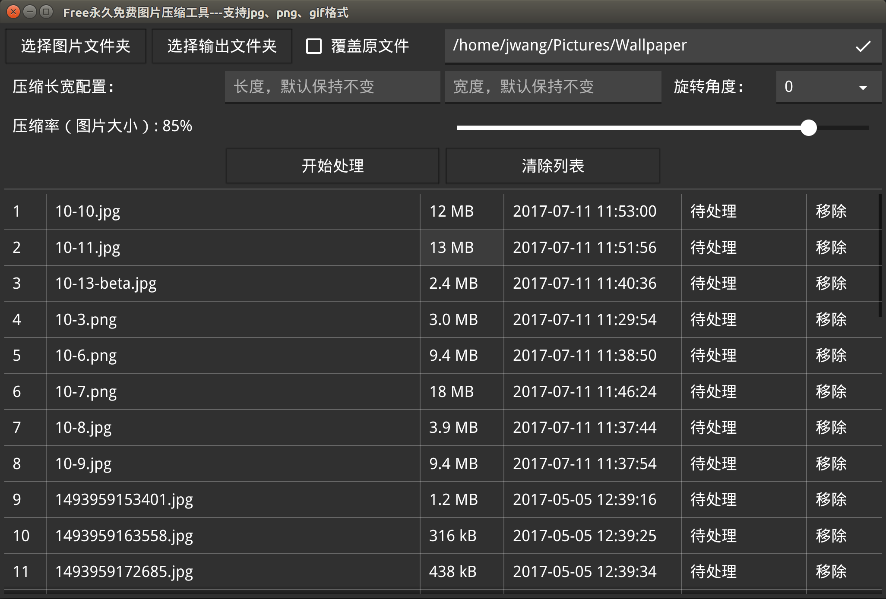
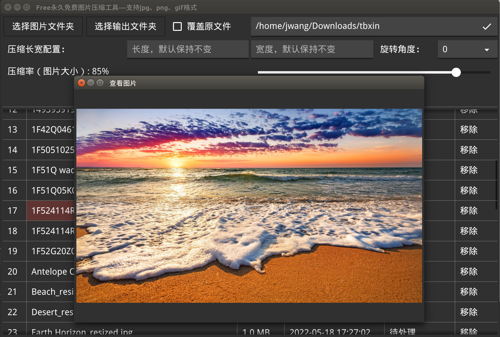

# 永久免费的图片压缩工具

现在手机拍的照片大小动不动就高达10MB，恰好最近遇到一件事，需要上传照片到某网站，发现限制大小为3MB。。。于是想办法压缩图片！

因为我是Linux系统，所以第一时间想到有没有在线压缩图片的网站，找了几个发现确实可以用，但是一旦需要大批量操作的时候不是要会员就是要登录，或者只能一张张下载，着实费劲，所以决定自己写一个桌面客户端。

其实整个过程非常简单，压缩的操作使用了一个开源库 [github.com/nfnt/resize](https://github.com/nfnt/resize)，该库实现了png、jpg、gif格式图片的缩放，并且支持多种插值采样算法。

图形界面这块使用了[Fyne](https://fyne.io/fyne/v2)，个人感觉这个库是Go语言目前最成熟可用性最强的GUI库了，实现上面这样的界面非常快，我只花了1天就完成了。

## 使用文档

### 1.选择输入文件夹
原本准备实现图片多选功能，然后发现fyne库的组件暂时不支持多选，只能单选，所以最后做成选择文件夹。选择一个文件夹，下面会展示文件夹下格式为png、jpg、gif的文件。

点击最右侧的 **移除**　可以从列表里面去除该文件。

点击第二列图片名称可以查看图片

### 2.设置输出文件夹
默认情况下会自动使用输入文件夹作为输出文件夹，但是不会覆盖原文件，会在名字里面追加“_resized”。

比如原文件名为 text.jpg，压缩后生成文件名为　text_resized.jpg

勾选 **覆盖原文件**　复选框则会在用压缩后的文件替换原文件，该不操作不可逆，请谨慎选择！

也可以选择其它输出文件夹，支持手动输入目录，如果目录不存在，则会自动创建。

### 3.设置长宽比和旋转角度
* 如果长和宽都为0，则不改变长和宽
* 如果长和宽有一个不为0，则维持默认长宽比的情况下自动缩放
* 如果长和宽都不为0，则会固定长宽比，图片可能会变形，请谨慎操作！

默认不旋转，支持设置90度、180度、270度顺时针旋转，需要的可以勾选上。

### ４.设置压缩率
这块是最影响压缩后图片大小的地方，默认为85%，这个数字越小生成的图片越小，如果为100%则几乎不变。

实测早压缩率为85%的情况下，一张5MB的图片压缩后大小在1MB左右，大家可以根据自己的需求调节该选项。